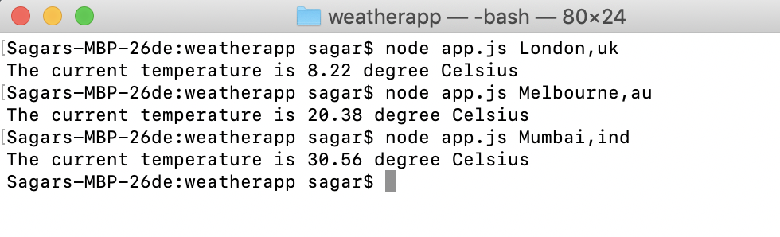

# WeatherApp
Simple NodeJS weather app tells you the temperature of the city you type

## Working
The application makes use of an available API that makes the request call to the weather application and receives the weather information in the form of a JSON message.
This JSON messaged is parsed and the temperature is displayed.

## Command

Enter the city name, state and country code divided by comma, use ISO 3166 country codes.

